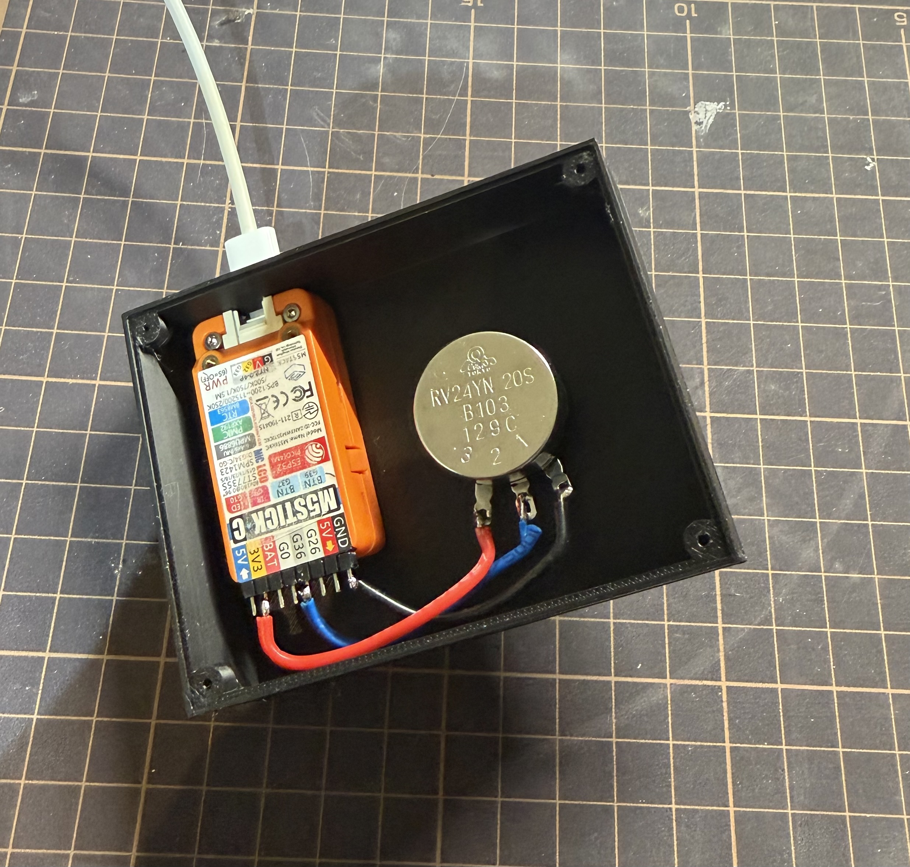
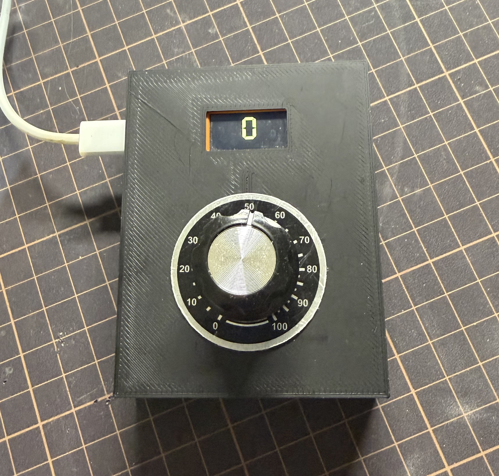

# M5StickC 可変抵抗読み取り装置

M5StickC で可変抵抗の値を読み取り、

- M5StickC の画面に大きく表示する
- USB シリアルへ整数値を書き出す
- Mac 側の GUI で値を読む

ためのサンプルです。

現在の M5StickC 版では、可変抵抗の値を `-10` から `10` の整数に変換して扱います。

## ケース写真

 可変抵抗器と M5StickC をケースに収めた写真：





## 1. 主なファイル

- `M5StickC_ADC.ino`: M5StickC 用の Arduino スケッチ本体
- `read_value_gui.py`: シリアル値を PC 上で大きく表示する Python GUI サンプル
- `CAD/VolumeBox.scad`: ケースの OpenSCAD 元データ
- `CAD/VolumeBox.stl`: ケース本体の STL
- `CAD/urabuta.stl`: 裏ぶたの STL
- `esp32/ESP32_S3_ADC.ino`: XIAO ESP32-S3 向けの参考スケッチ

通常は `M5StickC_ADC.ino` と `read_value_gui.py` を使います。

## 2. M5StickC でできること

- 可変抵抗器の値を `GPIO36` から読む
- 値を `-10` から `10` の整数へ線形変換する
- M5StickC の LCD に数字を表示する
- シリアルへ同じ値を 1 行ずつ出力する

現在の設定:

- 通信速度: `115200`
- 読み取り回数: 1 秒に `10` 回
- 出力レンジ: `-10` から `10`

## 3. 必要なもの

- M5StickC
- 可変抵抗器
- ジャンパ線
- USB Type-C ケーブル
- Arduino IDE
- `M5StickC` ライブラリ

## 4. 配線

M5StickC では、可変抵抗の電源を **3.3V** から取ってください。

重要:

- Grove コネクタの電源は `5V` です
- 可変抵抗を `5V` で駆動すると、ADC 入力に 3.3V を超える電圧が出る可能性があります
- このプロジェクトは、拡張ヘッダ側の `3V3` / `GND` / `G36` を使う前提です

接続:

- 可変抵抗器の `GND` -> M5StickC の `GND`
- 可変抵抗器の `VCC` -> M5StickC の `3V3`
- 可変抵抗器の `VALUE` -> M5StickC の `G36`

ASCII 配線図:

```text
可変抵抗器                         M5StickC

  [ GND ] ----------------------> [ GND ]
  [ VCC ] ----------------------> [ 3V3 ]
  [ VALUE ] --------------------> [ G36 ]
```

## 5. Arduino IDE で開く

1. Arduino IDE を起動します
2. `File > Open...` を選びます
3. `M5StickC_ADC/M5StickC_ADC.ino` を開きます

ライブラリが未導入なら、`Tools > Manage Libraries...` で `M5StickC` を検索してインストールしてください。

## 6. ボード設定

Arduino IDE の `Tools` で、少なくとも次を確認してください。

- `Board`: `M5Stick-C`
- `Port`: 接続した M5StickC のポート

ポート名の例:

- `/dev/cu.usbserial-*****`

`M5Stick-C` が一覧にない場合:

- ESP32 系のボードパッケージか M5Stack 系ボード定義が未導入の可能性があります
- Arduino IDE の Board Manager から必要なボード定義を導入してください

## 7. 書き込み

1. M5StickC を USB で Mac に接続します
2. `Tools > Port` で `/dev/cu.usbserial-*****` 形式のポートを選びます
3. Arduino IDE 左上の `Upload` を押します

## 8. シリアルモニタ

1. `Tools > Serial Monitor` を開きます
2. 通信速度を `115200` に設定します

正しく動くと、次のように `-10` から `10` の整数が表示されます。

```text
-10
-3
0
10
```

## 9. 画面表示

M5StickC の LCD には、シリアルと同じ値を横向き画面いっぱいに大きく表示します。

- 表示範囲は `-10` から `10`
- シリアルへ出している値と同じ整数
- 更新周期は読み取り周期と同じです

## 10. Mac 側 GUI

`read_value_gui.py` は、M5StickC から来るシリアル値を PC 上に大きく表示するための簡単な GUI です。

前提:

- Python 3
- `pyserial`

例:

```bash
python3 read_value_gui.py --port /dev/cu.usbserial-*****
```

ポートを省略すると、自動検出を試みます。

## 11. 設定を変える

`M5StickC_ADC.ino` の先頭の定数を変更します。

```cpp
constexpr uint8_t kPotPin = 36;
constexpr uint32_t kSamplesPerSecond = 10;
constexpr int32_t kOutputMin = -10;
constexpr int32_t kOutputMax = 10;
```

### 出力レンジを変える

`-10` から `10` 以外にしたい場合は、この 2 行を変更してください。

```cpp
constexpr int32_t kOutputMin = -10;
constexpr int32_t kOutputMax = 10;
```

例:

- `0` から `100` にしたい: `kOutputMin = 0`, `kOutputMax = 100`
- `-50` から `50` にしたい: `kOutputMin = -50`, `kOutputMax = 50`

シリアル出力と画面表示は、どちらも同じレンジに自動で変わります。

## 13. CAD データ

ケースの 3D データは `CAD/` に置いています。

- `CAD/VolumeBox.scad`: OpenSCAD 元データ
- `CAD/VolumeBox.stl`: ケース本体の STL
- `CAD/urabuta.stl`: 裏ぶたの STL

## 14. 動かないときの確認

### 数値が変わらない

- `VALUE` が `G36` に接続されているか
- 可変抵抗の電源が `3V3` になっているか
- `GND` が共通になっているか

### -10 や 10 に張り付く

- 配線ミスの可能性があります
- 特に `VALUE` の接続先と `VCC` 電圧を確認してください

### 画面に何も出ない

- `M5StickC` ライブラリが入っているか
- ボード設定が `M5Stick-C` になっているか
- `Tools > Port` で `/dev/cu.usbserial-*****` を選んでいるか
- 起動直後に画面が黒のままなら、いったんリセットして再確認してください

## 15. XIAO ESP32-S3 版について

`ESP32_S3_ADC.ino`  XIAO ESP32-S3 向けスケッチです。
こちらは M5StickC 版の主対象ではなく、配線や ADC 読み取りの比較用・参考用として残しています。

XIAO 版の特徴:

- 入力ピンは `A10`
- シリアルへ `0` から `100` の整数を出力
- 読み取り時に内蔵 LED を短く点灯

## 16. 補足

- M5StickC では可変抵抗の電源を `3.3V` から取ってください
- Grove 側 `5V` をそのまま ADC 入力系に使わないでください
- M5StickC のシリアルポート名は `/dev/cu.usbserial-*****` になることがあります
